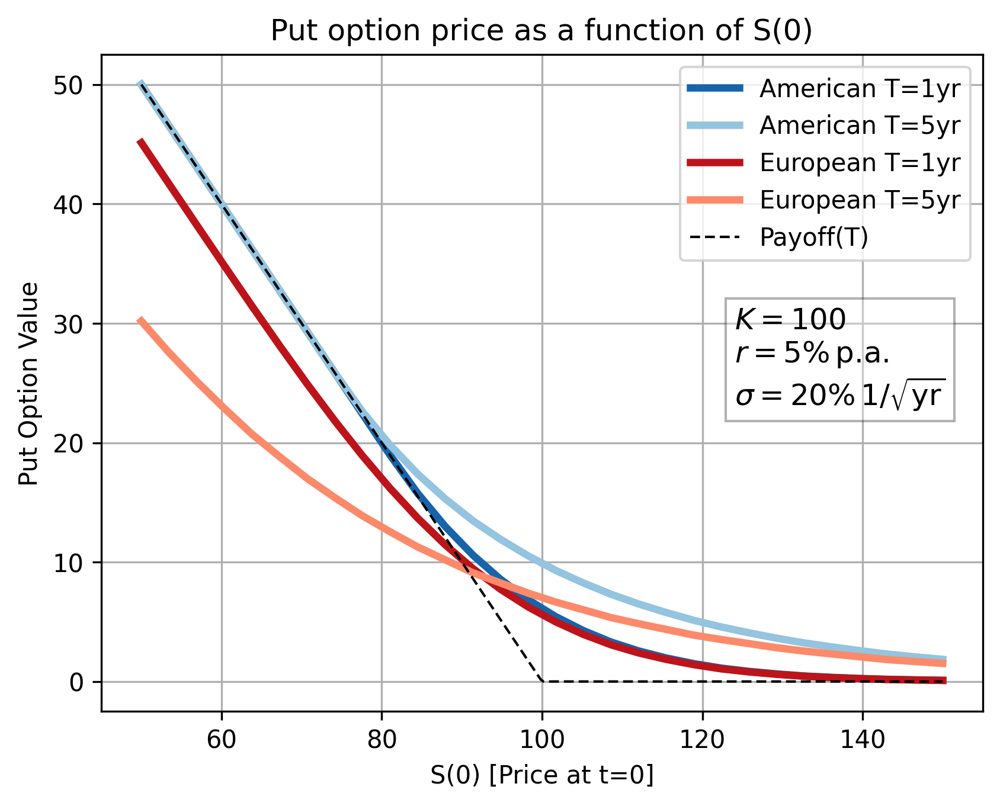
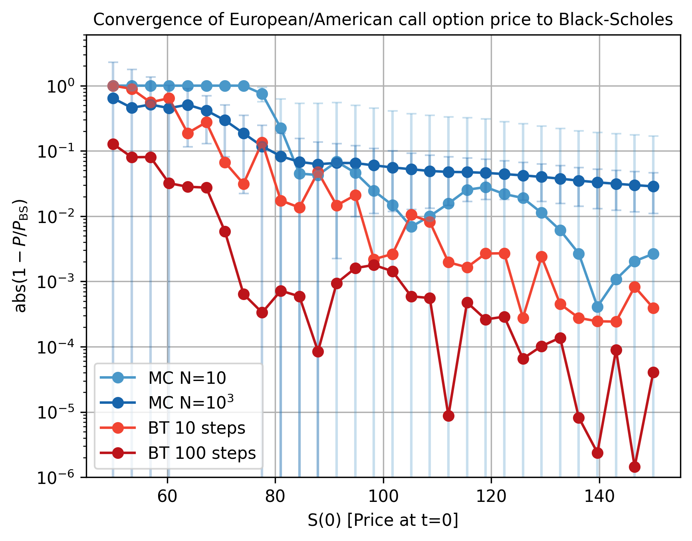

# Quant finance portfolio

This repository showcases my work in **quantitative finance**, applying numerical methods and simulations.  
It demonstrates my ability to **model stochastic processes**, **implement algorithms from scratch**, and **analyze convergence and error** - skills directly relevant to quantitative research and trading.

---

## 🧩 Skills Demonstrated

- **Stochastic Modeling:** Geometric Brownian Motion (GBM) for asset price simulation.  
- **Numerical Methods:** Binomial tree pricing, Monte Carlo simulation, error analysis.  
- **Analytical Finance:** Black–Scholes closed-form benchmarks, Greeks, payoff structures.  
- **Computational Skills:** Python, NumPy, SciPy, Matplotlib, Jupyter.  
- **Research Mindset:** Comparing methods, analyzing convergence rates, validating against theory.  

---

## 📂 Project Highlights

### 1. Option Pricing Methods (Binomial Trees, Monte Carlo, Black–Scholes)

- Implemented and compared three core approaches to option pricing:
  - **Binomial trees** (American vs. European calls/puts, convergence to Black–Scholes).
  - **Black–Scholes benchmarks** (closed-form solutions, butterfly spread payoff).
  - **Monte Carlo simulation** (GBM under risk-neutral measure, confidence intervals, error scaling).
- Analyzed sensitivities to strike, maturity, and volatility, highlighting convergence and early exercise effects.
  
👉 Skills: stochastic simulation, numerical methods, analytical finance, error analysis, visualization.

### 2. Volatility Estimation (Historical, Rolling, EWMA)

- Implemented and compared multiple approaches to volatility estimation:
  - **Historical volatility** (using log returns, annualization).
  - **Rolling window estimates** (sliding windows to track changing variance).
  - **Exponentially Weighted Moving Average (EWMA)** (linking half-life to decay factor λ).
- Visualized and compared methods across different time periods, highlighting responsiveness to market shocks and the trade-off between smoothness and reactivity.

👉 Skills: time-series modeling, statistical finance, stochastic processes, data visualization.

---

## 📊 Example Figures

**American vs. European Put Prices**

**ITM/OTM Put Options as a function of expiry**

**Monte Carlo Convergence with Error Bars**

---
